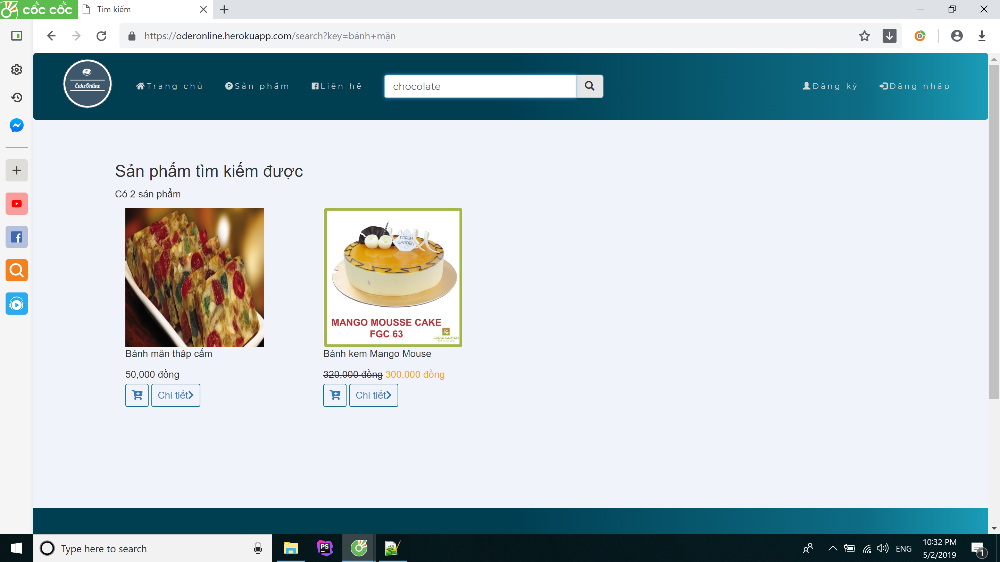
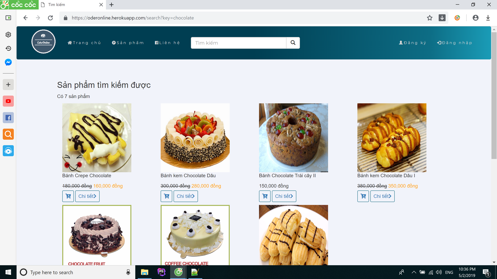
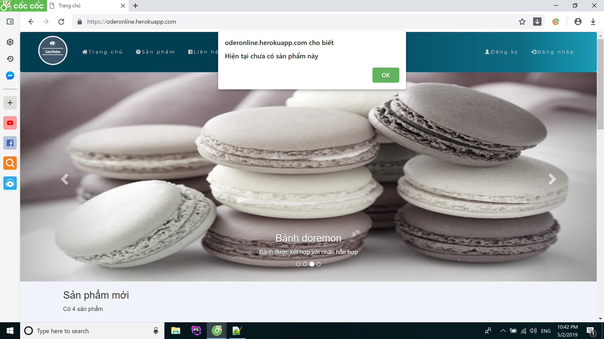

# Báo cáo bài tập lớn
## Sinh viên: ĐÀO ĐỨC KHIÊM
## Mã sinh viên: 17020837

Thương mại điện tử hiện nay đang rất phổ biến trên mạng và phát triển rất nhanh chóng. Trước kia chúng ta đã từng biết đến Amazon, Alibaba, A đây rồi!,... là những công ty thương
mại điện tử đa quốc gia, vì thế để cạnh tranh thì chắc chắn họ sẽ có những trang web bạn hàng vô cùng xịn sò, chuyên nghiệp, đạt hiệu quả marketing cao. Chính bởi sự tiện lợi của
các web này mà họ đã thu hút được rất nhiều khách hàng và đưa sự phục vụ khách hàng lên một mức độ rất cao. Nhóm 5 đã dựa trên các trang web đó để thiết kế ra một trang web đơn
giản: Trang web bán bánh ngọt có tên là OderOnline. Nhằm mang lại lợi ích cho cả người mua và người bán bởi sự tiện dụng, linh hoạt và dễ sử dụng.

### User story: Là một người mua hàng, tôi muốn có thể tìm kiếm sản phẩm trên trang web thông qua các từ khóa để tôi có thể nhanh chóng tìm được sản phẩm mà mình muốn mua.
Hướng dẫn sử dụng:
1. Mở trình duyệt của bạn lên. Google chrome hoặc FireFox,... tùy trình duyệt bạn cài đặt.
2. Gõ vào ô tìm kiếm địa chỉ sau: Oderonline.herokuapp.com
3. Sau khi trang web hiện ra bạn sẽ nhìn thấy ngay ô tìm kiếm màu trắng nằm ngang hàng với Logo của website. Hãy click vào đó và gõ từ khóa bạn cần tìm. ví dụ: Bánh mặn, Chocolate,...
Rồi sau đó bạn click vào icon  hoặc hãy nhấn Enter trang sẽ trả về kết quả cho bạn.

4. Kết quả hiển thị sẽ cho biết được số sản phẩm tìm được và thông tin của từng sản phẩm bao gồm hình ảnh, giá. bạn click vào **Detail** để xem chi tiết về sản phẩm và biểu tượng giỏ
hàng để mua sản phẩm.

Nếu bạn nhập từ không đúng hoặc sản phẩm đó đã hết hàng hoặc chưa có bày bán thì kết quả sẽ trả về là **hiện chưa có sản phẩm này**
