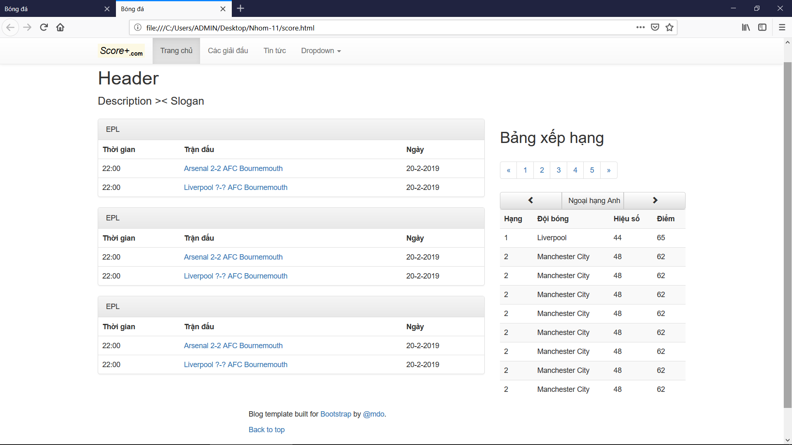

# Nhóm 11
## Thành viên:
    Trần Hải Dương
    Đinh Việt Cường
    Mai Thế Đại
    Nguyễn Văn Đình

**Tên sản phẩm:** ...  
**Người sử dụng:** Những người đam mê bóng đá và muốn theo dõi 5 giải đấu hấp dẫn nhất châu Âu nhưng không có nhiều thời gian  
**Mô tả về phầm mềm:**  
      * Đây là một trang web thể thao về bóng đá. Mục đích là cập nhật tỷ số, thông số kỹ thuật của trận đấu một cách nhanh nhất,
    lịch thi đấu, bảng xếp hạng của các giải đấu hàng đầu Châu Âu, và cả trong nước. Ngoài ra trang còn tổng hợp video bàn thắng, các tình huống đáng chú ý.  
      * Thêm vào đó, trang web có các thông tin bên lề như thông tin đội bóng, tình hình lực lượng, thông tin chuyển nhượng. Giao diện chính là thanh trên cùng   
    là các nước, đại diện cho các giải đấu hàng đầu thế giới. Trong mỗi giải đấu là các thông tin cụ thể của từng đội bóng, bảng xếp hạng...  
      * Bên dưới của giao diện chính, là kết quả trận đấu vừa mới kết thúc và được cập nhật.  
    Giao diện cơ bản của trang web:

    
   ## SCRUM
### Vai trò:
-	Product Owner: Người dùng
-	Scrum Master: 
-	Team Development: 4 thành viên trong nhóm
### Product backlog:
-	Lịch thi đấu và kết quả các trận đấu gần đây: thời gian diễn ra, tỷ số , thống kê, …
-	Thông tin về giải đấu: Lịch thi đấu, bảng xếp hạng, kết quả, …
-	Thông tin về đội bóng: HLV, SVĐ, cầu thủ, …
-	Highlights & một vài thông tin bên lề
-	Hỗ trợ và tương tác với người dung ( có thể không làm )
### Tuần 1-4:
-	**Kế hoạch:** Hoàn thành tính năng xem lịch thi đấu và kết quả

### Tuần 4-8:
-	**Kế hoạch:**
### Tuần 8-12:
-	**Kế hoạch:**

