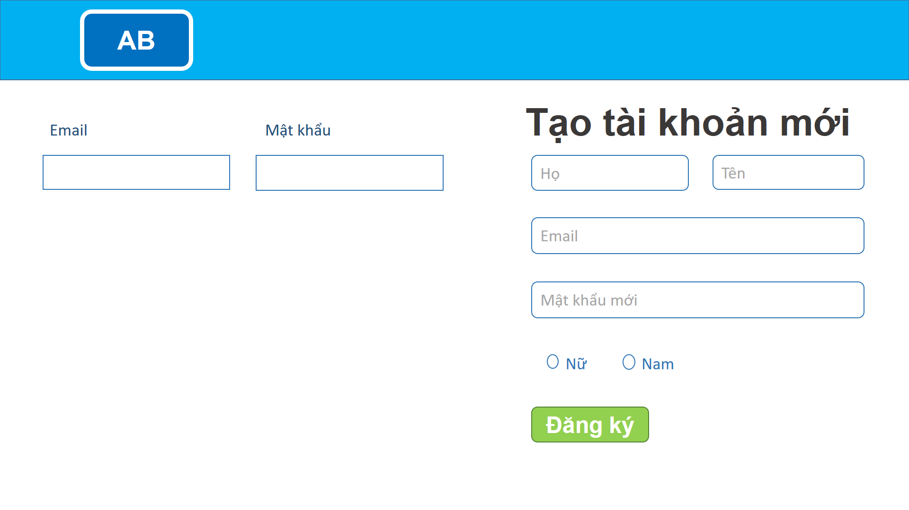
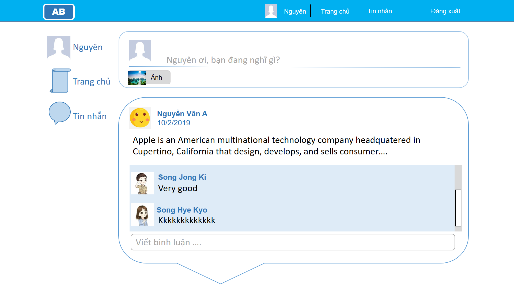
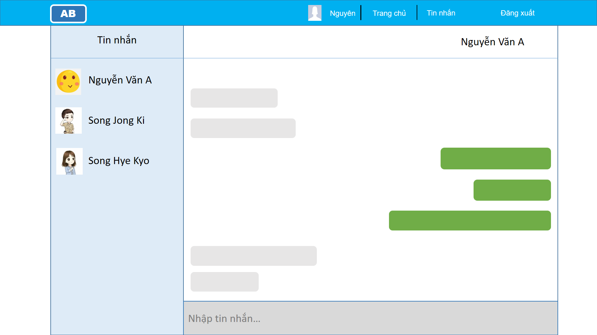

# INT2208-7-2019
## Nhóm-1

<h1 style="">Response App</h1>
<h3>Một thứ luôn "phản hồi" và "tương tác" với bạn"...</h3>

Response App là một mạng xã hội dạng nhỏ (group) phục vụ cho một mục đích nhỏ, với những tính năng cơ bản, giao diện đơn giản dễ nhìn.

<h4>Mục tiêu: </h4>

Những người dùng mạng xã hội có hội nhóm nhỏ và những mục đích nhỏ, không nhiều "group" loạn như facebook (ví dụ như: http://confluence.i2g.cloud)

<h4>Tính năng:</h4>
<ol>
    <li>Đăng ký, đăng nhập, authentication với JWT</li>
    <li>news feed xem toàn bộ các bài đăng </li>
    <li>chat messenger</li>
    <li>trang xem user profile và chỉnh sửa</li>
</ol>

<h4>Thành viên:</h4>
<ol>
    <li>Phan Phương Nam.</li>
    <li>Phạm Thị Thảo Nguyên</li>
    <li>Phạm Thị Như Quỳnh</li>
    <li>Trần Anh Dũng</li>
</ol>

<h3>Change log</h3>

<h4>(11/2/2019) Demo:</h4>

Đăng ký, đăng nhập:

Xem news feed

Messenger chat đơn giản

 
 

<h4>(11/2/2019)Định hướng phát triển: </h4>
<h5>Phương thức thực hiện: mô hình phát triển phần mềm Scrum</h5>
<ul>
    <li>Product Owner,Scrum Master: Phan Phương Nam</li>
    <li>Development Team: Phan Phương Nam, Phạm Thị Thảo Nguyên, Phạm Thị Như Quỳnh, Trần Anh Dũng </li>
</ul>
<h5>Product backlog:</h5>
<ol>
    <li>hệ thống lưu trữ thông tin user, trang đăng kí đăng nhập và nav bar điều hướng</li>
    <li>trang user profile và kết bạn</li>
    <li>trang news feed và tính năng tìm kiếm</li>
    <li>trang chat messenger giữa bạn bè</li>
    <li>còn cập nhật sau...</li>
</ol>

Simple app, just response.

