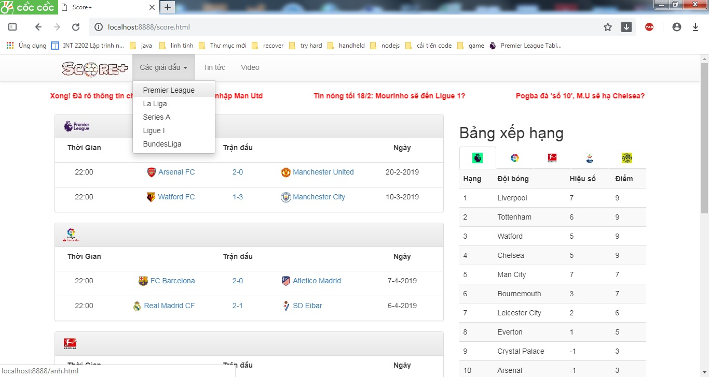
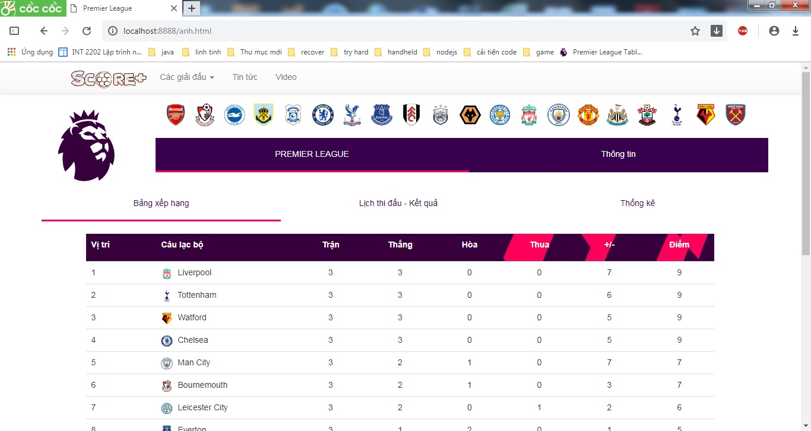
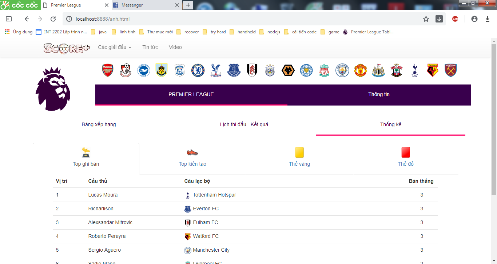
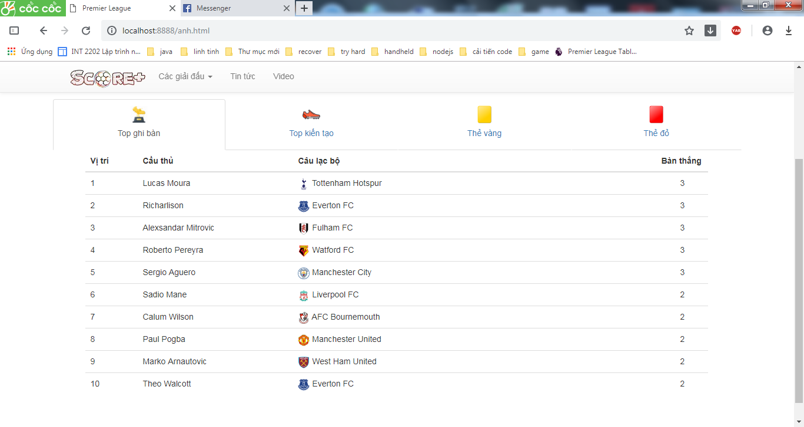
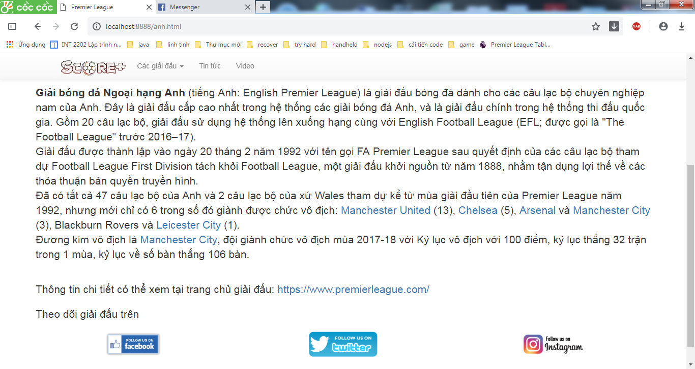

# BÁO CÁO CÁ NHÂN
	Họ và tên: Đinh Việt Cường
	MSSV: 17020624
 ## Câu chuyện người dùng

**Là** một người yêu bóng đá 
**tôi muốn** biết những thông tin cơ bản về giải đấu như bảng xếp hạng, lịch thi đấu và kết quả 
**để** biết được những diễn biến của giải đấu.

## Phân tích câu chuyện
- Tạo giao diện cho các giải đấu.(Sử dụng mẫu thiết kế MVP - Low level design) 
	⋅⋅* [Github commit](https://github.com/duong17020661/INT2208-7-2019/commit/d3b6ba6a5afffbd9f32bfd2a7407d52fdf792cee) 
	⋅⋅* [Github commit](https://github.com/duong17020661/INT2208-7-2019/commit/8734e4a504902888e2935f7ccea1e46f3f97366b) 
	⋅⋅* [Github commit](https://github.com/duong17020661/INT2208-7-2019/commit/b261290353f2bb6a535e13320ecd597f8dbf9e87) 
	(chưa bao gồm các lần chỉnh sửa nhỏ khác)
- Tạo cơ sở dữ liệu cho các giải đấu (High level design)

	1.Danh sách cầu thủ thi đấu tại từng giải- [Github commit](https://github.com/duong17020661/INT2208-7-2019/commit/973bb210d0d110681def6cd1b22fc306892fd1b8)  
	
	2.Hình ảnh, biểu tượng, Logo cho từng giải đấu.
	⋅⋅* [Github commit](https://github.com/duong17020661/INT2208-7-2019/commit/52dce4218d69c3ced00fe98def126a6b129848bb)
	⋅⋅* [Github commit](https://github.com/duong17020661/INT2208-7-2019/commit/8734e4a504902888e2935f7ccea1e46f3f97366b)
	⋅⋅* [Github commit](https://github.com/duong17020661/INT2208-7-2019/commit/b261290353f2bb6a535e13320ecd597f8dbf9e87) 
	(chưa bao gồm các lần chỉnh sửa nhỏ khác)
	
	3.Kết quả và lịch thi đấu tại mỗi giải - [Github commit](https://github.com/duong17020661/INT2208-7-2019/commit/fcc26c9147033693db3ccead81bcac946444d6ef) 
 	
	4.Thông tin cơ bản khác của từng giải - [Github commit](https://github.com/duong17020661/INT2208-7-2019/commit/b261290353f2bb6a535e13320ecd597f8dbf9e87)

	5.Số liệu thống kê của từng giải- [Github commit](https://github.com/duong17020661/INT2208-7-2019/commit/2dc9d1e874bbdfe774ff6a4de201456806761a59)
	
- Kiểm thử: Sử dụng bảng quyết định (Decision Tables) - Kiểm thử hộp đen 	

- Đánh giá mã nguồn:

	1.Xem code có mã mùi có thể làm ảnh hưởng đến việc phát triển hay không. - (Code smells) 
	
	2.Phân tích source để phát hiện những lỗi sai, bug, vi phạm lỗi sai viết code. - (Phân tích tĩnh)  
- Thử chạy ở chế độ điện thoại 

## Cách tra cứu thông tin giải đấu (cách sử dụng)
- Đầu tiên vào trang web (theo hướng dẫn sử dụng).

- Vào mục **Các giải đấu** sau đó lựa chọn giải đấu bạn muốn tra cứu thông tin (ví dụ: Premier League)
     
    

## Giới thiệu chức năng
    
   Đây là một chức năng giúp ta biết về những thông tin cơ bản của một giải đấu, giúp chúng ta dễ dàng hơn trong việc theo dõi diễn biến của từng giải, đồng thời biết thêm thông tin khác liên quan đến giải đấu (sơ lược lịch sử, liên kết ngoài). 

   Giao diện chức năng: 

   	 
   
   Ở giao diện đầu tiên ta có thể thấy một vài mục cơ bản gồm tên giải, thông tin liên kết ngoài tới giải đấu cũng như logo của các đội bóng đang thi đấu tại giải
   Phần bên dưới chính là bảng xếp hạng các đội bóng thi đấu tại giải.

   	
   
   Bên cạnh bảng xếp hạng chính là lịch thi đấu và kết quả của các đội bóng đó ở giải hiện tại. 
   	
   	
   	
   	
   
   Tiếp theo là mục **Thống kê** với các số liệu thống kê liên quan tới các đội bóng thuộc giải đó bao gồm: cầu thủ ghi bàn tốt nhất, kiến tạo nhiều nhất, đội bóng chịu nhiều thẻ phạt nhất. Bên dưới là minh họa cho 1 nội dung thuộc mục **Thống kê** của giải:
   	
   		

   	

   Cuối cùng là mục **Thông tin** số thông tin sơ lược khác về giải đấu như lịch sử hình thành, thể lệ thi đấu, nhà vô địch cũng như liên kết tới giải đấu qua các mạng xã hội: Facebook, Twitter và Instagram.

   	 

   	 
   