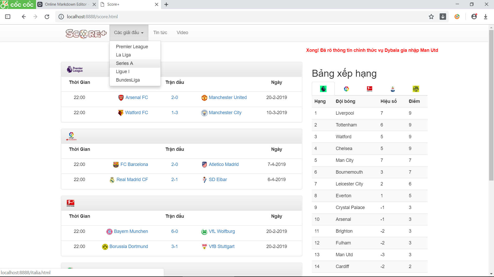
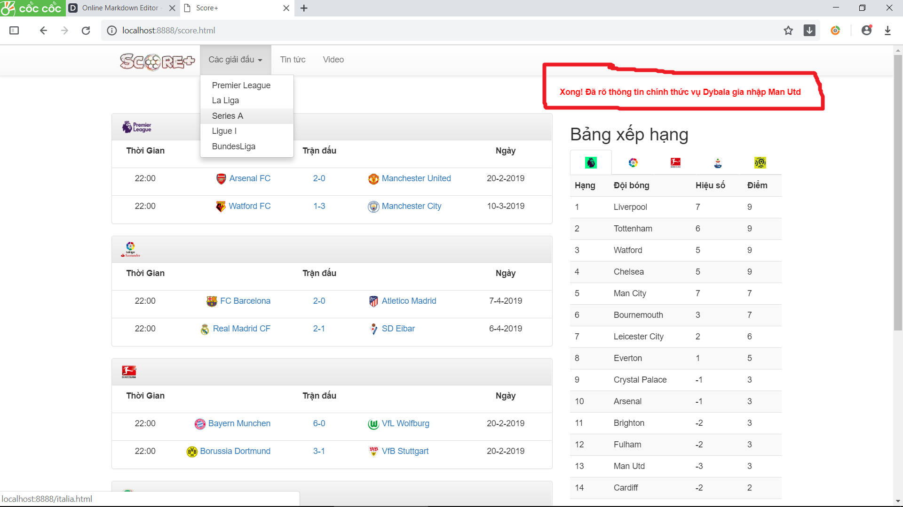

# BÁO CÁO CÁ NHÂN
	Họ và tên: Mai Thế Đại
	MSSV: 17020663

## Câu chuyện người dùng

**Là** một người yêu bóng đá 
**tôi muốn** biết lịch thi đấu và kết quả những trận đấu tâm điểm của các vòng đấu gần nhất
**để** có thể theo dõi diễn biến các trận đấu đó.

## Phân tích câu chuyện
- Tạo giao diện trang web.
	[Mẫu thiết kế MVP](http://bit.ly/2IXYcFY)	
    [Github commit](https://github.com/duong17020661/INT2208-7-2019/commit/d706a519e5b91c7d47fca87589314b2305b33c8f)

**Github commit** 
https://github.com/duong17020661/INT2208-7-2019/commit/d706a519e5b91c7d47fca87589314b2305b33c8f

- Tạo cơ sở dữ liệu về các đội bóng

	1.Danh sách cầu thủ
	**Github commit** 
    https://github.com/duong17020661/INT2208-7-2019/commit/3c8ba2bf5e6e58a63ba4d26f2e2a2d0f50f7b696
    https://github.com/duong17020661/INT2208-7-2019/commit/972ac82031455c536879d4db47abe16dad9c59e3
    https://github.com/duong17020661/INT2208-7-2019/commit/b78cc18bdb9f0664e46ef7c14891e4c7ea4cd0c3

    3.Các thông số của trận đấu
    **Github commit** 
    https://github.com/duong17020661/INT2208-7-2019/commit/705353c7a4142f39330cb8f47fa00b904a021f41

## Giới thiệu giao diện web

Dòng tin nóng chạy liên tục gây sự chú ý cho người dùng

## Giới thiệu chức năng
    
   Đây là một trang web giúp ta biết về những thông tin mới nhất của các giải đấu hàng đầu thế giới, giúp chúng ta dễ dàng hơn trong việc theo dõi diễn biến của từng trận cầu hấp dẫn, đồng thời biết thêm thông tin khác liên quan đến giải đấu, đội bóng và các câu chuyện bên lề sân cỏ. 

- Demo code
1. Chạy thử và xem các chức năng đã sử dụng được chưa.
[Phân tích vùng biên - kiểm thử hộp đen](http://bit.ly/2vq5xGh)
2. Nếu có lỗi sửa và quay lại 1.
**Github commit**
https://github.com/duong17020661/INT2208-7-2019/commit/b8f1038b048a53c2c5a2daecba722e51de73a3dd
	
- Review code
	1.Xem code có mã mùi có thể làm ảnh hưởng đến việc phát triển hay không.
	[Mã mùi](http://bit.ly/2J4HML)
	2.Phân tích source để phát hiện những lỗi sai, bug, vi phạm lỗi sai viết code.
	[Phân tích tĩnh](http://bit.ly/2UOhzDs)
	**Github commit**
- Tái cấu trúc 
	[Tái cấu trúc](http://bit.ly/2XWSZCx)
- Thử chạy ở chế độ điện thoại
	**Github commit**

## Thu hoạch sau khi kết thúc môn học:
- Hoàn thành khoá học SoftEng1x.
- Hoàn thành khoá học [Bootstrap](https://o7planning.org/en/11745/bootstrap).
- Hoàn thành khoá học CSS, HTML, JS trên [O7planning](https://o7planning.org/) [W3schools](https://www.w3schools.com/).

