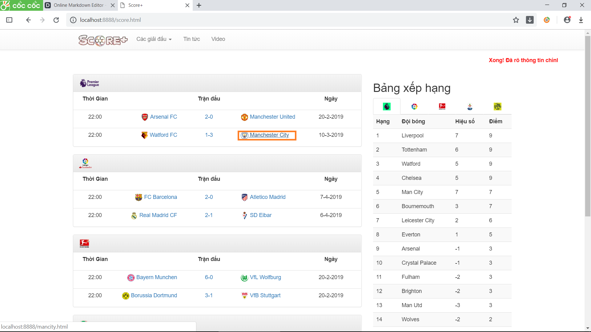
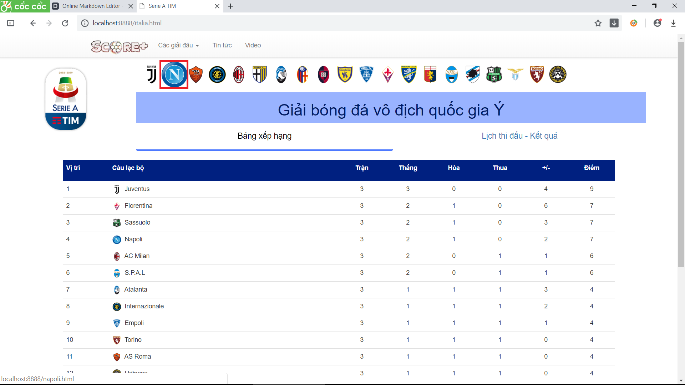
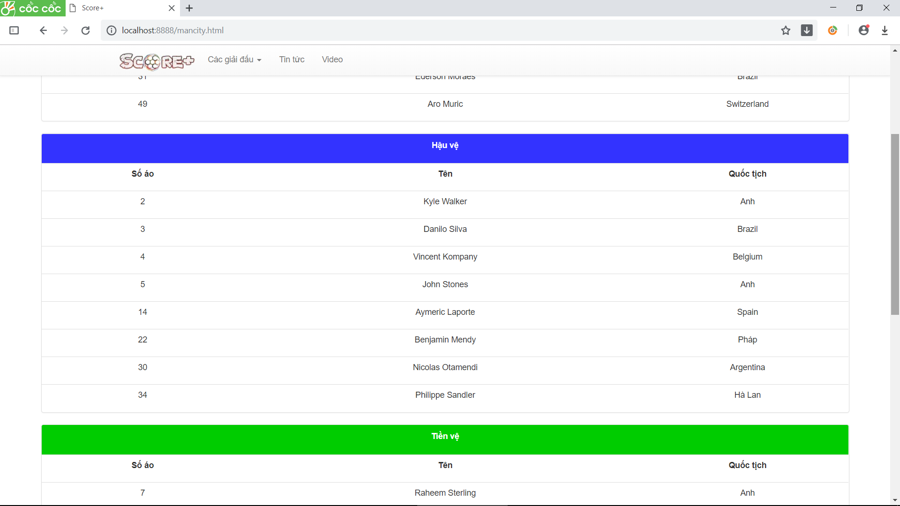
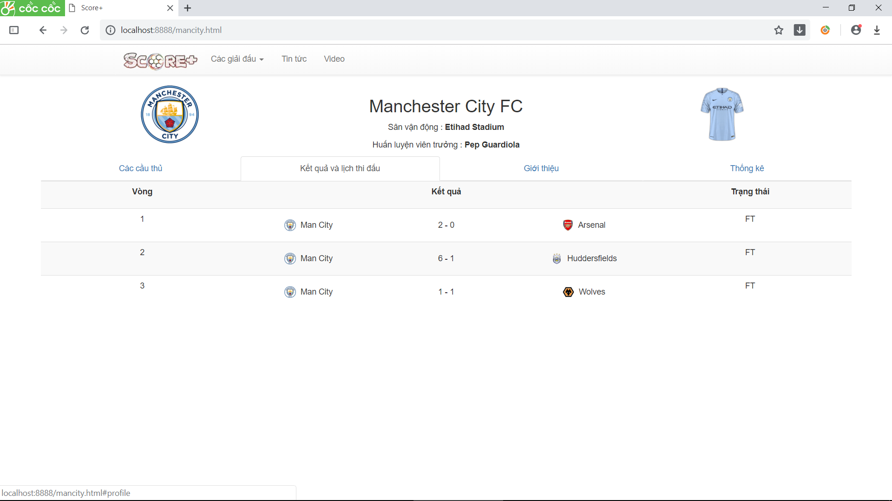
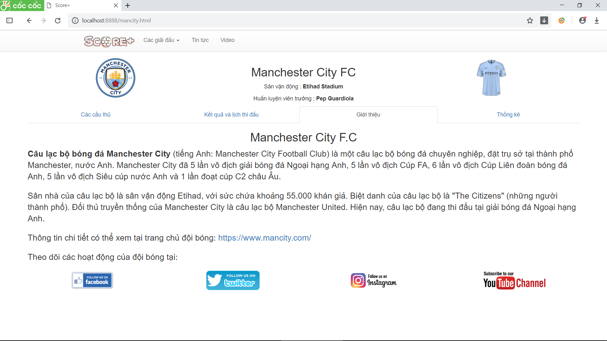
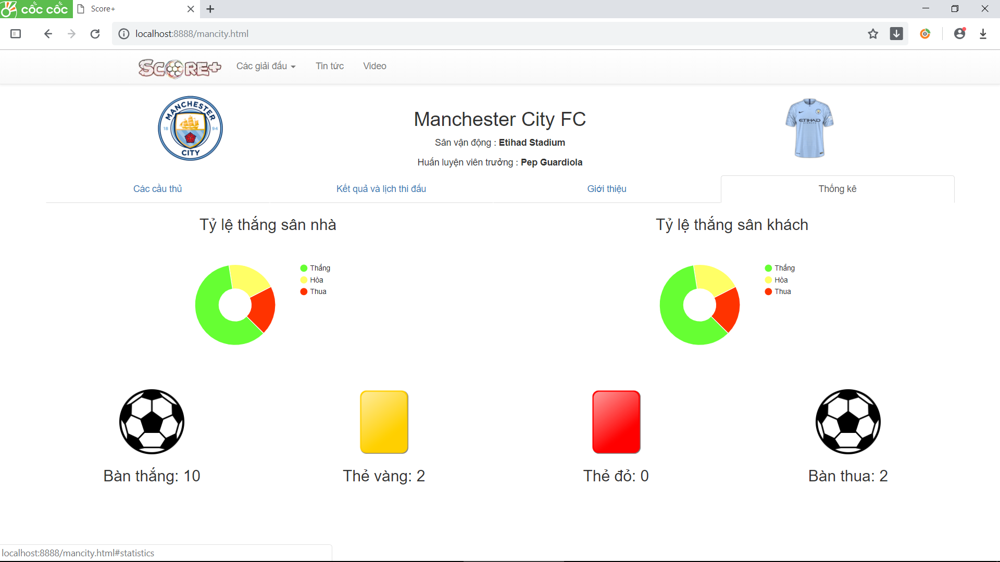

# BÁO CÁO CÁ NHÂN
	Họ và tên: Trần Hải Dương
	MSSV: 17020661
 ## Câu chuyện người dùng

**Là** một người yêu bóng đá 
**tôi muốn** biết những thông tin cơ bản về các đội bóng như lịch thi đấu, kết quả, các cầu thủ cũng như một số thông tin liên quan đến đội bóng
**để** bổ sung cho bản thân những hiểu biết về bóng đá.

## Phân tích câu chuyện
- Tạo giao diện thông tin về 1 đội bóng.(Sử dụng mẫu thiết kế MVP - Low level design) - [Github commit](https://github.com/duong17020661/INT2208-7-2019/commit/a158529fc40498519b53ec5ddcf16b044ff3903c) 
- Tạo cơ sở dữ liệu về các đội bóng (High level design)

	1.Danh sách cầu thủ - [Github commit](https://github.com/duong17020661/INT2208-7-2019/commit/973bb210d0d110681def6cd1b22fc306892fd1b8)  
	
	2.Biểu tượng đội bóng và áo thi đấu. - [Github commit](https://github.com/duong17020661/INT2208-7-2019/commit/7c7007d73d5ce806f9e9f6dcab04be9a028d48c9) 

	3.Kết quả và lịch thi đấu.- [Github commit](https://github.com/duong17020661/INT2208-7-2019/commit/fcc26c9147033693db3ccead81bcac946444d6ef) 
 	
	4.Thông tin cơ bản: Huấn luyện viên, tên đội bóng, sân nhà. - [Github commit](https://github.com/duong17020661/INT2208-7-2019/commit/271d32a9c273070f80331817f98e04ccfe9e62e5)
	
- Kiểm thử: Sử dụng bảng quyết định (Decision Tables) - Kiểm thử hộp đen 	

- Đánh giá mã nguồn:

	1.Xem code có mã mùi có thể làm ảnh hưởng đến việc phát triển hay không. - (Code smells) 
	
	2.Phân tích source để phát hiện những lỗi sai, bug, vi phạm lỗi sai viết code. - (Phân tích tĩnh)  
- Thử chạy ở chế độ điện thoại 

## Cách xem thông tin đội bóng (cách sử dụng)
- Đầu tiên vào trang web theo hướng dẫn sử dụng.

Có 2 cách để xem thông tin 
- **Cách 1:** Bấm vào tên các đội bóng ở trang chủ 
     
- **Cách 2:** Vào trang thông tin các giải đấu (Các giải đấu -> Chọn giải) sau đó bấm vào biểu
tượng đội bóng muốn xem. 
     
     

## Giới thiệu chức năng
    
   Đây là một chức năng giúp ta biết về những thông tin cơ bản của một đội bóng để giúp chúng ta dễ dàng hơn trong việc theo dõi các trận đấu cũng như giúp ta biết thêm một số thông tin cơ bản về các đội bóng chúng ta theo dõi. 
    
   Giao diện chức năng: 
	 
   Ngay khi giao diện hiện ra ta có thể thấy những thông tin cơ bản của một đội bóng bao gồm tên sân vận động, huấn luyện viên trưởng đội bóng, biểu tượng cũng như áo thi sân nhà của đội bóng đó. Ở bên dưới là danh sách các cầu thủ được đăng ký ở đội hình chính và những thông tin  về các cầu thủ đó. 
	 
   Bên cạnh danh sách cầu thủ là thông tin về lịch thi đấu và kết quả của đội bóng đó ở giải quốc nội. 
   	 
   Tiếp đến là phần giới thiệu các thông tin bên lề đội bóng, trang chủ và nơi theo dõi hoạt động của đội bóng đó. 
	 
   Cuối cùng là một số thống kê về phong độ sân nhà, sân khách và các thông số cơ bản như thẻ vàng, thẻ đỏ, số bàn thắng bàn thua.  
	 
    
    
