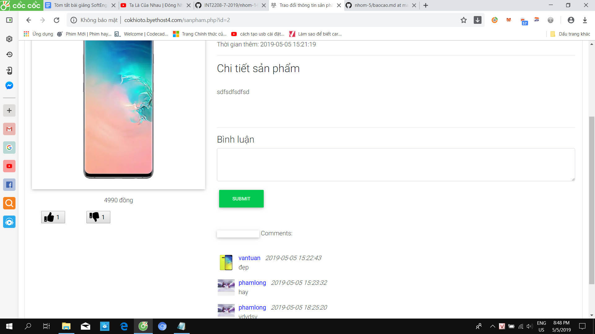

## Sinh viên: Phạm Đức Long
## Mã sinh viên: 17020866
### Nhóm dự án: Nhóm 14
### Vai trò: Developer.
*********************
# Báo cáo cá nhân môn học Công nghệ phần mềm
====
* Hoàn thành khóa học trên edx (Đã chụp ảnh màn hình)
* Bài tập nhóm: **Dự án web trao đổi thông tin sản phẩm** [website](http://cokhioto.byethost4.com), [Github](https://github.com/HugManh/INT2208-7-2019/tree/master/nhom-14)
* User story: Là một người muốn tham khảo các sản phẩm, tôi muốn có thể biết chi tiết về sản phẩm, các bình luận đánh giá sản phẩm, số lượng like và dislike từ đó thấy được sự nổi bật của sản phẩm.
	[chi tiết](https://github.com/HugManh/INT2208-7-2019/issues/9):
	1) Xác định yêu cầu, mong muốn: 
		- Bình luận về sản phẩm ngay trên trang web (yêu cầu chức năng - specifications)
		- Ấn like hoặc dislike (yêu cầu chức năng - specifications)
	Yêu cầu này đã đảm bảo nguyên tắc INVEST guideline.
	2) Quy trình phát triển Scrum (process)
	3) Thiết kế cấu trúc cơ sở dữ liệu và sơ đồ lớp (high level design)
	4) Viết mã([chi tiết](https://github.com/HugManh/INT2208-7-2019/blob/master/nhom-14/WEB/sanpham.php))
	5) Kiểm thử:
		- Kiểm thử hộp trắng đảm bảo mã nguồn không bị lỗi, build và run được.
		- Sử dụng localhost để chỉnh bố cục cho thanh bình luận, các bình luận đã được submit và được hiển thị phía dưới, nút like và dislike
		- Sử dụng localhost kiểm tra xem web có cho gõ vào thanh bình luận hay không, nút like và dislike có hoạt động hay không
		- Sử dụng localhost để kiểm tra xem web có hiển thị đúng nội dung bình luận, số like, số dislike hay không
	6) Tái cấu trúc: Rà soát mã nguồn để đảm bảo rõ ràng, đơn giản, sạch sẽ và không có mã xấu.(construction)
* Hướng dẫn sử dụng:
1. Mở trình duyệt của bạn lên. Google chrome hoặc FireFox,... tùy trình duyệt bạn cài đặt.

2. Gõ vào ô tìm kiếm địa chỉ sau: cokhioto.byethost4.com

3. Sau khi trang web hiện ra bạn hãy đăng nhập tài khoản của mình vì nếu bạn không đăng nhập thì bạn không thể bình luận cũng như like và dislike. Sau đó
bạn hãy ấn vào sản phẩm mình cần xem sau đó sẽ có 1 thanh bình luận phía dưới mục chi tiết sản phẩm bạn có thể gõ bình luận của mình vào đó sau đó ấn SUBMIT.
bình luận của bạn sẽ được hiển thị bên dưới có hiển thị cả thời gian ngày tháng năm mà bạn bình luận.

4. Nếu bạn chưa nhập bình luận mà vẫn ấn SUBMIT thì sẽ hiện ra thông báo "Vui lòng điền vào trường này" [comment2](comment2.png).

5. Bạn có thể đánh giá sự nổi bật của sản phẩm bằng cách ấn nút like hoặc dislike ở bên dưới sản phẩm chú ý mỗi tài khoản có thể viết nhiều bình luận nhưng
chỉ có thể ấn một lượt like hoặc một lượt dislike tức là ví dụ nếu bạn ấn like rồi mà bạn muốn đổi lại ấn nút dislike thì thự động phần like của bạn sẽ mất đi thay vào đó là dislike.

