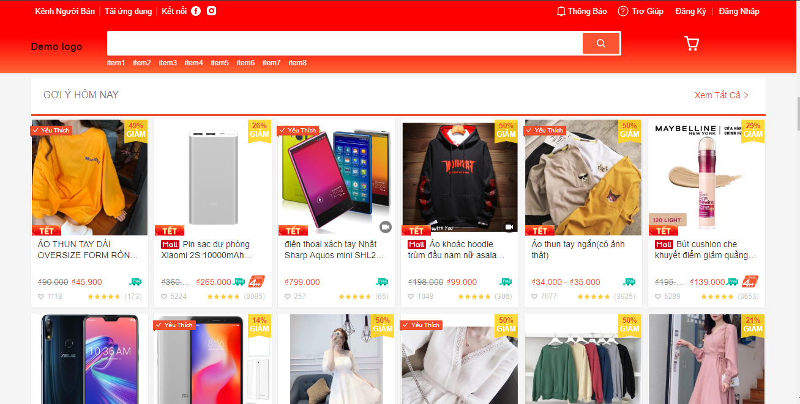
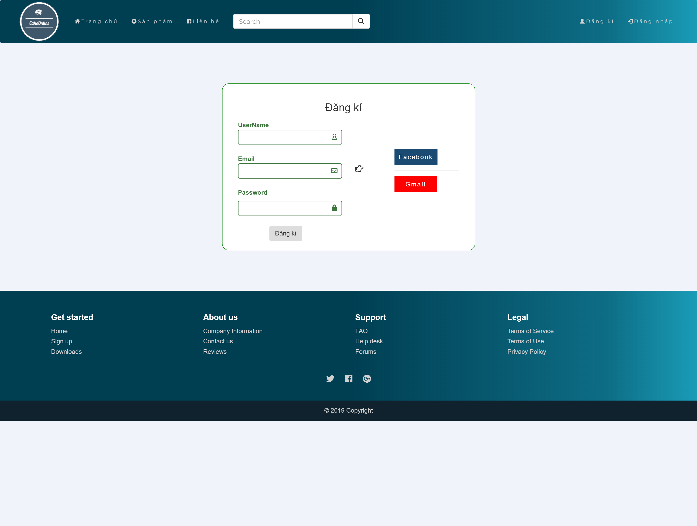

Nhóm 5:
=======
- Nguyễn Cảnh Hoàng
- Nguyễn Đức Lộc
- Đinh Sỹ Hào
- Đào Đức Khiêm
## App Mua Bán Hàng Online

Tên ứng dụng: **OrderOnline**

Nhóm người dùng: mọi người.

Chức năng:
1. Hiển thị các mặt hàng bao gồm hình ảnh và giá của sản phẩm có sao đánh giá kèm theo.

2. Chức năng tìm kiếm mặt hàng.
3. Tạo tài khoản, đăng nhập và đăng xuất.

4. Tiến hành đặt hàng, thanh toán và vận chuyển.

5. Phản hồi đánh giá.
6. Nhắn tin trao đổi.

## Quy trình phát triển Scrum:
### Các công đoạn trong một sprint (vòng lặp):
1) Đề ra các mục tiêu cần hoàn thành.
2) Lập danh sách công việc và phân chia công việc.
3) Kiểm thử.
4) Cải tiến.
### Thời hạn của một sprint:
- Một sprint kéo dài 1 tuần và các công việc bắt buộc phải dừng lại khi sprint kết thúc để đánh giá mức độ hoàn thiện, giải quyết các vấn đề phát sinh và cải thiện khả năng làm việc của cả nhóm.

### Danh sách công việc:
- Tạo cơ sở dữ liệu với các cấu trúc dữ liệu và phương thức nhập xuất dữ liệu phù hợp.
- Tạo chức năng đăng ký, đăng nhập, đăng xuất tài khoản, lưu thông tin vào cơ sở dữ liệu.
- Xử lý dữ liệu trong quá trình đặt hàng và thanh toán  (thay đổi các thông tin về số lượng hàng hóa, tình trạng gói hàng, số tiền trong các tài khoản thực hiện giao dịch).
- Tạo chức năng phân loại danh mục và tìm kiếm mặt hàng.
- Tạo chức năng nhắn tin trao dổi giữa giữa các tài khoản

**Product Owner: Đào Đức Khiêm**
- Tạo product backlog
- Sắp sếp công việc theo thứ tự ưu tiên từ trên xuống dưới
- Viết product backlog rõ ràng chi tiết dễ hiểu
- Trong quy trình suy nghĩ để loại bỏ những hạng mục không cần thiết.

**Scrum Master: Nguyễn Đức Lộc**
- Đánh giá khối lượng công việc của từng công việc trong product-backlog.
- Tạo sprint-backlog hợp lý với khả năng của nhóm.
- Phân công công việc phù hợp cho từng người trong nhóm phát triển tùy thuộc theo khả năng.
- Theo dõi tiến độ làm việc của thành viên và điều chỉnh công việc cho hợp lý.

**Development Team: Nguyễn Cảnh Hoàng, Đinh Sỹ Hào, Nguyễn Đức Lộc, Đào Đức Khiêm**
- Viết mã cho phần mềm.
- Hoàn thiện từng chức năng theo yêu cầu về chất lượng và thời hạn đã đề ra trong sprint.
- Kiểm thử sản phẩm.
- Viết hướng dẫn sử dụng.

**User stories:**
- Là một người mua hàng, tôi muốn nhìn thấy các mặt hàng để tôi có thể xem và lựa chọn.
- Là một người mua hàng, tôi muốn tiến hành đặt hàng ngay trên hệ thống bao gồm cả thanh toán online.
- Là quản trị viên của shop bán hàng, tôi muốn kiểm tra đơn hàng của khách hàng.
- Là quản trị viên của shop bán hàng, tôi muốn thêm, sửa, xóa các sản phẩm.
- Là một người mua hàng, tôi có thể tìm kiếm thứ tôi muốn mua trên hệ thống.
- Là một người mua hàng, tôi muốn có một tài khoản lưu thông tin của tôi để không phải nhập lại nhiều lần.
- Là một người mua hàng, tôi có thể đánh giá sản phẩm sau khi nhận hàng từ shop.

**Link demo sản phẩm:** [tại đây](nguoitheohuonghoa.herokuapp.com)