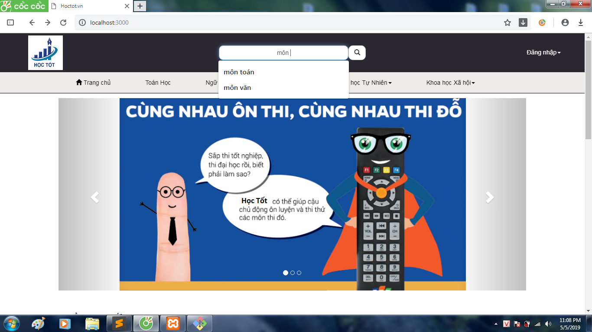
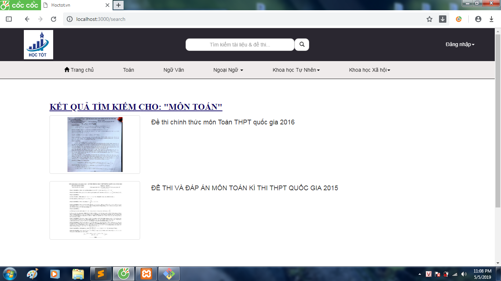
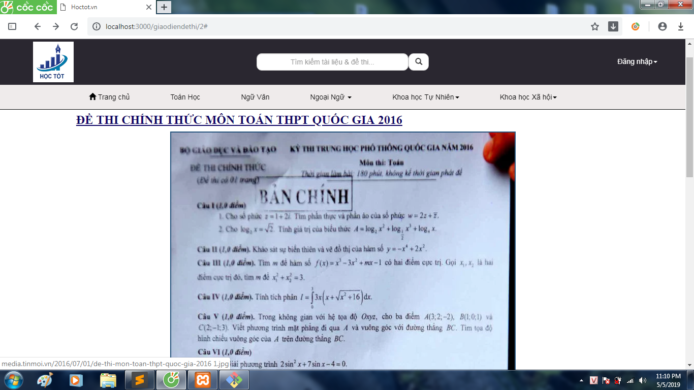

## Sinh viên: Bùi Văn Bảo
## Mã sinh viên: 17020599
### Nhóm dự án: Nhóm 8
### Vai trò: Product Owner, Developer.

# Báo cáo cá nhân môn học Công nghệ phần mềm

***

* Bài tập nhóm: **Dự án web cung cấp đề thi các môn** [Github](https://github.com/buibaouet/INT2208-7-2019)
* User story: Là một học sinh, tôi muốn tìm kiếm các đề thi trên trang web để luyện tập, thông qua các từ khóa để tôi có thể nhanh chóng tìm kiếm được đề thi mà mình cần.
	
	1) Xác định yêu cầu, mong muốn: 
		- Tìm kiếm đề thi ngay trên web (yêu cầu chức năng - specifications)
		- Tìm kiếm nhanh và chính xác đề thi có liên quan đến từ khóa người dùng nhập (yêu cầu phi chức năng - specifications)
	Yêu cầu này đã đảm bảo nguyên tắc INVEST guideline.
	2) Quy trình phát triển Scrum (process)
	3) Thiết kế cấu trúc cơ sở dữ liệu và sơ đồ lớp (high level design)
	4) Sử dụng mô hình MVC của framework Laravel (low level design)
	5) Thực hiện:
		- Tìm hiểu về Javascript, sql.
		- Xây dựng CSDL để quản lý đề thi.
		- Liên kết CSDL để tìm kiếm đề thi trong CSDL.
		- Hiển thị các giá trị tìm kiếm ra trang web.
	6) Kiểm thử:
		- Kiểm thử hộp trắng đảm bảo mã nguồn không bị lỗi, build và run được
		- Sử dụng localhost để chỉnh bố cục cho thanh tìm kiếm trên web
		- Sử dụng localhost kiểm tra xem web có cho gõ vào thanh tìm kiếm hay không
		- Sử dụng localhost để kiểm tra xem web trả về có đúng kết quả tìm kiếm hay không
	7) Tái cấu trúc: Rà soát mã nguồn để đảm bảo rõ ràng, đơn giản, sạch sẽ và không có mã xấu.(construction)
* Hướng dẫn sử dụng:
1. Mở giao diện trang chủ ra bạn sẽ nhìn thấy ngay ô tìm kiếm màu trắng nằm ngang hàng với Logo và nút đăng nhập của website.

2. Gõ từ khóa vào ô tìm kiếm, sau đó click vào biểu tượng tìm kiếm hoặc nhấn phím enter.

3. Kết quả tìm kiếm sẽ được hiển thị bao gồm hình ảnh đề thi và tên đề thi.

4. Click vào hình ảnh đề thi bạn muốn xem để xem chi tiết và phần bình luận về đề thi.

