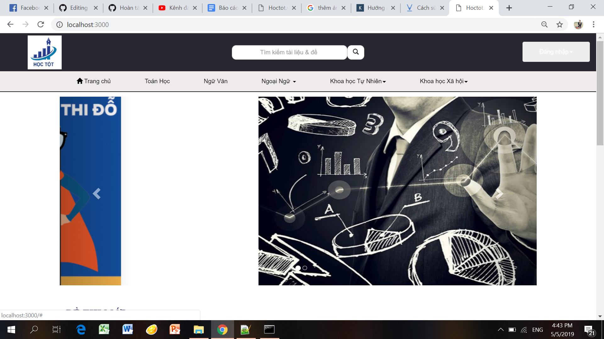
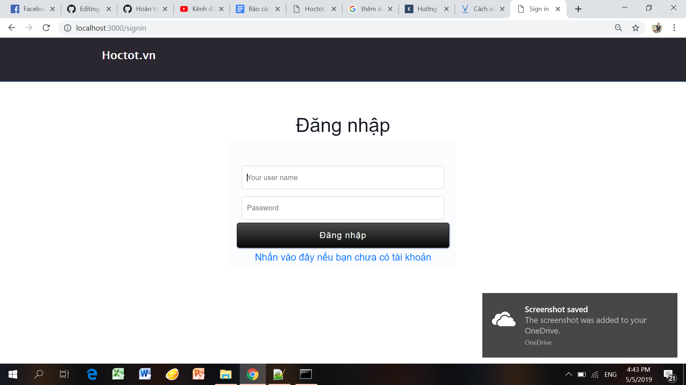
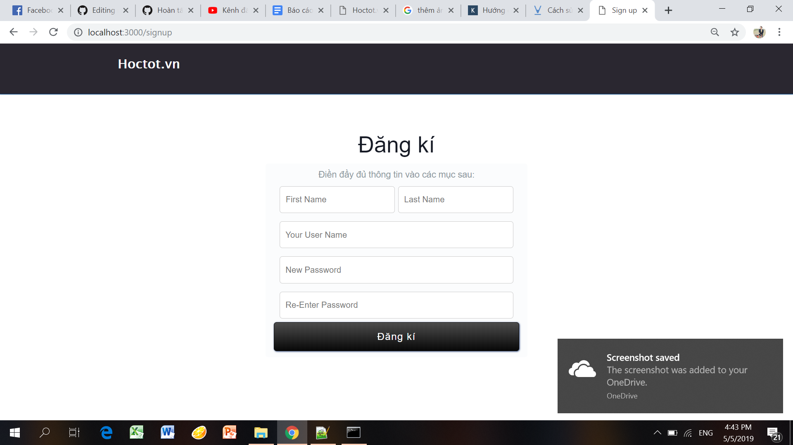
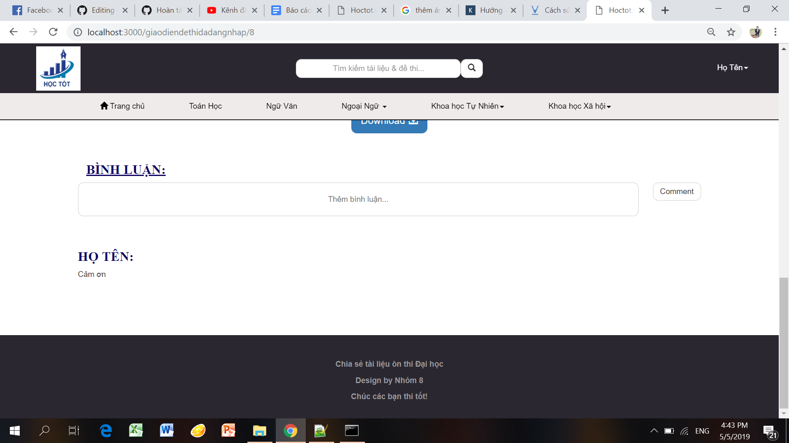

## Sinh viên: VŨ QUỐC TRƯỞNG
## Mã sinh viên: 17021094
### Nhóm dự án: Nhóm 8
### Vai trò: SCrum Master, Developer.

# Báo cáo cá nhân môn học Công nghệ phần mềm
* User story: Là một người dùng, tôi muốn đăng nhập để đưa ra bình luận.
1) Xác định yêu cầu, mong muốn: 
- Đăng nhập với tài khoản riêng.
- Sử dụng tài khoản để bình luận.
2) Thực hiện:
- Tìm hiểu về Javascript, sql.
- Xây dựng CSDL để quản lý các tài khoản.
- Liên kết CSDL đã tạo trên với giao diện đăng nhập, đăng kí đã tạo.
- Xây dựng CSDL lưu trữ các bình luận.
- Kết hợp CSDL để hoàn thành chức năng bình luận.
- Đưa ra các thông báo về trường hợp lỗi.
3) Kiểm thử:
- Kiểm thử hộp trắng đảm bảo mã nguồn không bị lỗi, chạy được.
- Thử các trường hợp lỗi để kiểm tra các chức năng.
- Sau đó, sửa lỗi nếu có.
- Tái cấu trúc mã nguồn và xử lí code xấu nếu có.

* Hướng dẫn sử dụng:
- Vào giao diện trang chủ.

- Đăng nhập với tài khoản của bạn.

- Nếu không có tài khoản thì đăng kí.

-Đưa ra bình luận bên dưới mỗi đề thi.

